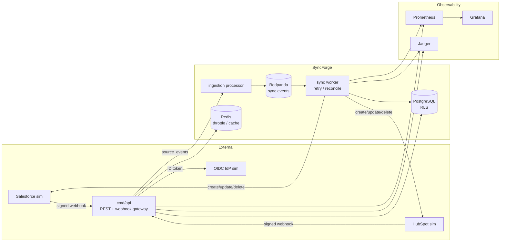
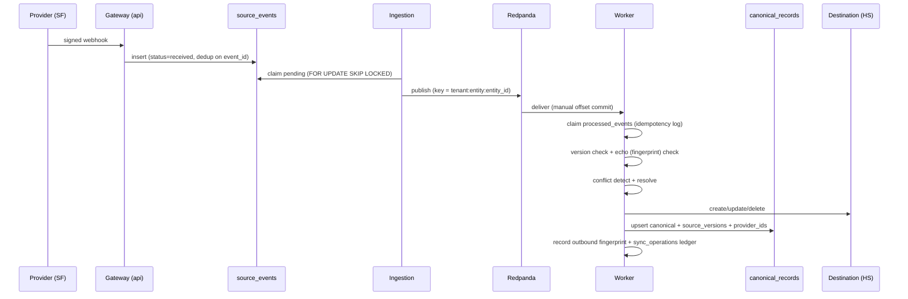
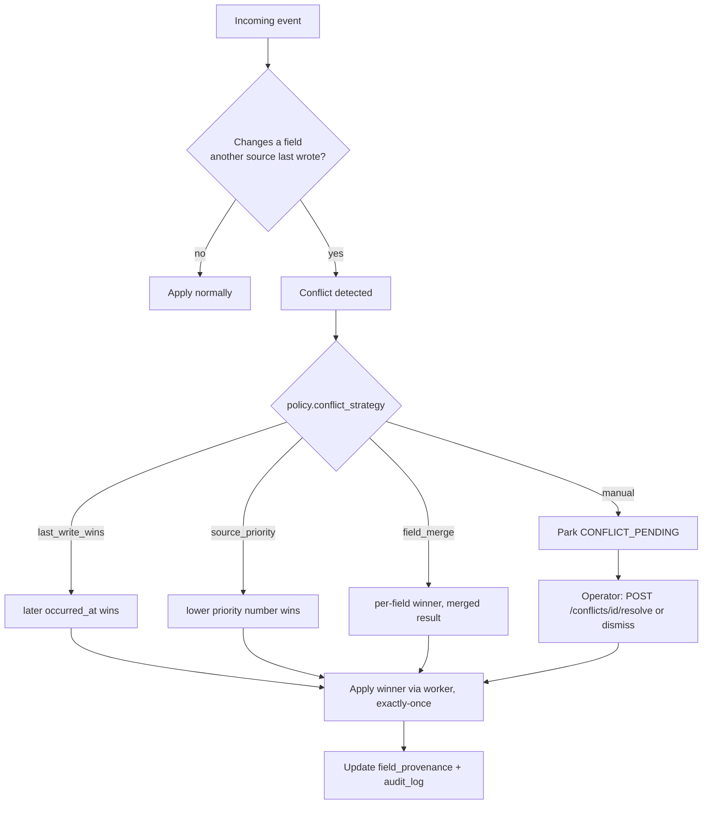
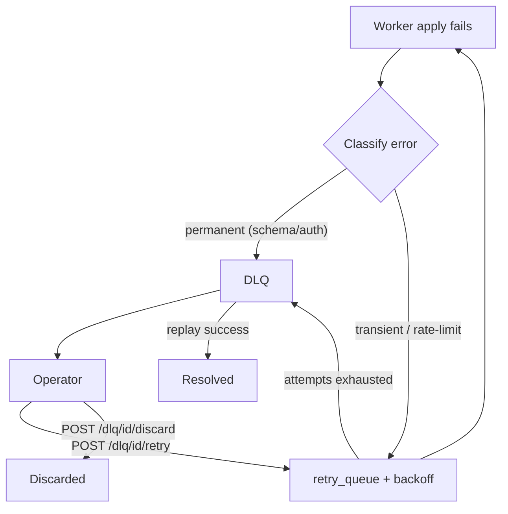
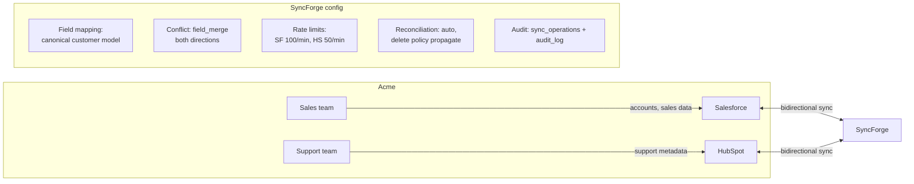

# SyncForge Architecture Diagrams

Five diagrams that describe the system. Each has a **Mermaid** version (renders
on GitHub) and an **ASCII** fallback (portable anywhere).

1. [High-level architecture](#1-high-level-architecture)
2. [Event lifecycle](#2-event-lifecycle)
3. [Conflict resolution](#3-conflict-resolution)
4. [Failure / retry / DLQ](#4-failure--retry--dlq)
5. [Acme customer deployment](#5-acme-customer-deployment)

---

## 1. High-level architecture



```
                Salesforce sim ──signed webhook──▶ cmd/api (REST + gateway)
                HubSpot sim    ──signed webhook──▶ cmd/api
                OIDC IdP sim   ──id token────────▶ cmd/api

   cmd/api ──source_events──▶ ingestion ──▶ Redpanda (sync.events) ──▶ sync worker
      │                          │                                  │
      ▼                          ▼                                  ▼
   PostgreSQL (RLS)          Redis (throttle)          create/update/delete ─▶ sims
      │
      └── Prometheus ── Grafana     Jaeger ◀── traces
```

---

## 2. Event lifecycle



```
Provider ─webhook─▶ Gateway ─▶ source_events ─▶ Ingestion ─▶ Redpanda ─▶ Worker
                                                                         │
   claim (idempotency) → version check → echo check → conflict resolve    │
                                                                         ▼
                                   destination (create/update/delete) ◀──┘
                                   canonical_records (fields, versions,
                                   provenance, provider ids)
                                   outbound_writes (fingerprint)
                                   sync_operations (ledger)
```

---

## 3. Conflict resolution



```
incoming event
   │
   ├─ same source / no effective change ─▶ apply normally
   └─ different source changed the field ─▶ CONFLICT
        │
        ├─ last_write_wins ─▶ later timestamp wins
        ├─ source_priority ─▶ lower priority number wins
        ├─ field_merge     ─▶ per-field winner, merged
        └─ manual          ─▶ park → operator resolve/dismiss
        │
        └─▶ worker applies winner exactly-once → updates provenance + audit
```

---

## 4. Failure / retry / DLQ



```
apply fails
  ├─ permanent (schema/auth) ─▶ DLQ ─▶ operator: retry | discard
  └─ transient / rate-limit  ─▶ retry_queue + exponential backoff
        └─ exhausted ─▶ DLQ ─▶ operator replay
```

---

## 5. Acme customer deployment



```
   Sales team ── Salesforce        HubSpot ── Support team
                   │   ▲              ▲   │
                   ▼   │              │   ▼
                     SyncForge
        field mapping | field_merge both ways | rate limits
        | auto reconciliation (propagate deletes) | durable audit
```

---

See [architecture.md](architecture.md), [consistency-model.md](consistency-model.md),
[conflict-resolution.md](conflict-resolution.md), [failure-recovery.md](failure-recovery.md),
and [customer-deployment.md](customer-deployment.md) for the written detail.
